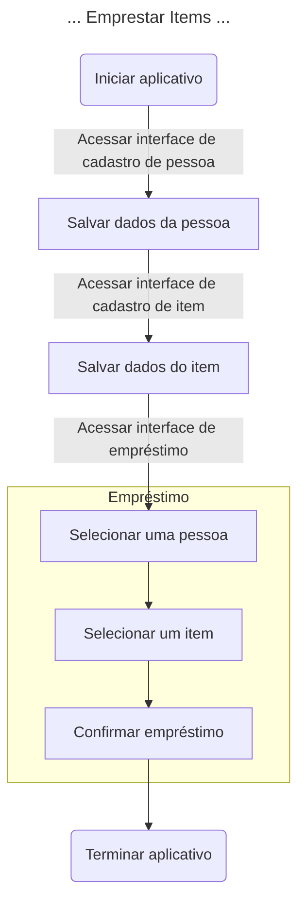
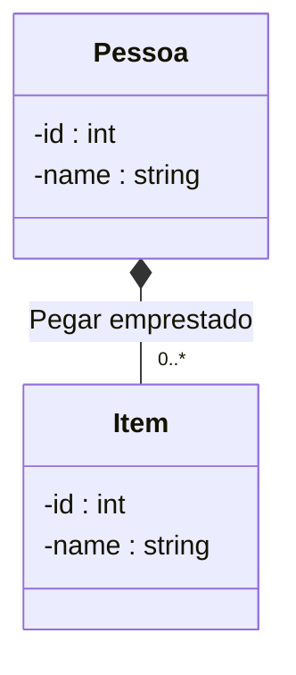

## Introdução
Percebi que há vários desenvolvedores juniores na comunidade de desenvolvimento de software em busca de idéias para portfólio ou para expandir seus conhecimentos técnicos.

Idealmente, um aplicativo para este fim não deve ser muito simples, pois os participantes perderiam o interesse; nem muito difícil, pois demandaria muito tempo ou estaria além das capacidades esperadas de um iniciante. Além disso, é bom restringirmos a algum problema com fins práticos, já que problemas abstratos podem ser encontrados em plataformas como [HackerRank](https://www.hackerrank.com) ou [LeetCode](https://leetcode.com).

Minha idéia é especificar os requisitos de um aplicativo, porém sem especificar qual tecnologia utilizar. Dessa forma, o projeto fica bastante genérico e abrangente, permitindo que qualquer pessoa possa participar.

Esta idéia estará em constante evolução, sendo esta a Draft-v0.1. Vou deixar o conteúdo deste texto neste GitHub. Estou aberto a comentários e novas idéias. Todos são bem-vindos a criar pull requests no projeto.

>[!Note]
> Quando necessario, vou colocar algumas notas técnica para exclarecimento.

##  A idéia do aplicativo
Um dia qualquer, você vai almoçar com alguns amigos e um deles te apresenta ao Geraldo. Seu amigo comentou com Geraldo que você está aprendendo desenvolvimento de software. Geraldo é muito carismático e te explica um pouco da rotina dele, dizendo:

"Trabalho em uma empresa de médio porte e nosso escritório fica na região suburbana. Temos vários cubículos, algumas salas e um pequeno showroom para mostrar nosso trabalho para potenciais clientes. Além disso, temos um galpão com vários itens para ajudar no funcionamento da empresa. Lá você vai encontrar de tudo um pouco, incluindo: material de escritório, equipamento de manutenção da propriedade, equipamento de áudio e até equipamento de pesca. Nosso chefe adora pescar e, de vez em quando, os funcionários vão pescar juntos em um lago próximo ao nosso escritório."

"Pois então, eu gostaria de falar de um probleminha que temos em nosso galpão. Para ser franco, nós temos um péssimo controle do que entra e sai daquele galpão. Nunca tivemos furto, pelo menos não estou ciente de nenhum, contudo é difícil saber o que está no galpão em um determinado momento. Se algum item não está no galpão, temos que ficar enviando mensagens para os funcionários procurando saber quem está com o quê. Eu deixei um livro na entrada do galpão, e agora quem pegar ou devolver um item tem que escrever o que foi retirado ou devolvido. A idéia é boa, mas tem problemas; quando quero saber o inventário do galpão, tenho que ler várias entradas do livro para ter uma idéia dos itens do galpão. Às vezes, desisto do livro e saio olhando no galpão mesmo."

"Bom, acho que você já entendeu o problema que quero resolver. Eu poderia criar uma tabela no Excel para resolver este problema. Contudo, gostaria de algo melhor do que o Excel, pois no futuro, eu quero implementar esta mesma solução em outros escritórios de nossos clientes que disseram ter o mesmo problema. No futuro, até imagino colocar uma maquininha tipo aquelas de supermercado para ler código de barras que identifica o produto na retirada ou devolução. Vai ficar show."

"Você toparia desenvolver este software comigo?"

Vocês acertam a forma de pagamento e Geraldo está muito entusiasmado com a idéia. Ele te convida para visitar a sede da empresa e você confirma que o que Geraldo disse é verdade. Na verdade, as coisas são um pouco piores do que ele disse, mas a essência do que ele te contou está correta. Geraldo começa a pensar em um nome para o aplicativo; ele sugere "Empresta Fácil", mas nada está decidido ainda.

## Como o aplicativo vai solucionar o problema
Antes de começarmos a codificar, é uma boa idéia pensar em como o software vai funcionar de maneira geral. Devemos identificar os problemas concretos que os usuários do aplicativo estão enfrentando e como o aplicativo pode solucionar esses problemas. Por exemplo, podemos identificar alguns problemas óbvios: não saber o inventário com precisão e não saber qual funcionário está com determinado item. Podemos assumir alguns outros problemas, por exemplo, saber qual a data prevista de devolução, mas observe que este requisito nunca foi mencionado. Pode até ser uma boa idéia, mas por enquanto, vamos deixar o escopo o menor possível.

Primeiro vamos focar no mais importante: os empréstimos. Antes de realizarmos um empréstimo, temos que saber qual o _item_ a ser emprestado para uma _pessoa_; ou seja, a funcionalidade de empréstimo depende de outras funcionalidades, portanto, temos que implementar as dependências primeiro.

Para emprestar um item, teremos que:
1. Cadastrar a pessoa que vai pegar emprestado.
2. Cadastrar o item que vai ser emprestado.
3. Realizar o empréstimo.

Na perspectiva do aplicativo, teremos o seguinte fluxograma:

> [!NOTE]
> Neste projeto, quando utilizamos o termo "acessar interface", estamos nos referindo a qualquer interface do aplicativo. Se o programador optar por codificar um aplicativo web, então a interface seria uma página web. Se o programador optar por um aplicativo de linha de comando, então a interface seria um comando. Se o programador optar por uma REST API, então a interface seria um endpoint. E assim por diante.

> [!NOTE]
> Neste projeto vamos ignorar as permissões e dizer que o usuário do nosso sistema tem acesso a todas as funcionalidades do sistema.

## Modelagem de dados
Neste ponto, precisamos de uma quantidade pequena de dados para atender aos nossos requisitos. Vamos simplificar ao máximo os requisitos e ter apenas duas entidades: _pessoa_ e _item_, ambas com os atributos `id` e `nome`. Contudo, também precisamos representar o _empréstimo_ de alguma forma. A maneira mais simples seria criar uma associação na entidade _pessoa_ para indicar que uma _pessoa_ pode pegar um ou mais _itens_ emprestados.

> [!NOTE]
>Este diagrama de classes é apenas uma sugestão; você pode modelar o seu sistema como quiser.
>
>É importante observar que as _pessoas_ podem pegar _itens_ emprestados por meio de uma agregação com a cardinalidade de um para muitos (`0..*`). Podemos dizer que _uma pessoa pode ter muitos itens emprestados e um item pode estar emprestado para apenas uma pessoa_. Em orientação a objetos, a classe _Pessoa_ teria uma coleção (por exemplo, uma lista) de _Itens_ como atributo. 

## Histórias
Com base no fluxograma de empréstimos, fica fácil extrair as nossas primeiras histórias (também conhecidas como _User Stories_ ou _Cards_). Vou seguir o modelo que encontrei no site [Atlassian: Agile User Stories], apenas como referência. Cada time tem suas preferências.

Na prática, histórias podem ser quebradas em tarefas para que os desenvolvedores possam trabalhar. Exemplos de tarefas seriam: criar migração no banco de dados, automatizar o deploy da aplicação, codificar, testar em ambiente de validação. Não vou quebrar em tarefas neste projeto; isso fica a seu critério.

### História 1 - Cadastrar Pessoa
Como um administrador do sistema, eu quero cadastrar uma _pessoa_, para que eu possa emprestar itens para pessoas.

#### Definição de Concluído:
Esta história estará concluída quando:
* O administrador do sistema conseguir acessar a aplicação.
* O administrador do sistema conseguir acessar a interface de cadastro de pessoas.
* O administrador do sistema conseguir salvar os dados da pessoa na aplicação.

### História 2 - Cadastrar Item
Como um administrador do sistema, eu quero cadastrar um _item_, para que eu possa emprestar itens para pessoas.

#### Definição de Concluído:
Esta história estará concluída quando:
* O administrador do sistema conseguir acessar a aplicação.
* O administrador do sistema conseguir acessar a interface de cadastro de itens.
* O administrador do sistema conseguir salvar os dados do item na aplicação.

### História 3 - Emprestar Item para Pessoa
Como um administrador do sistema, eu quero emprestar um _item_ para uma _pessoa_, para que eu possa saber quais itens estão emprestados para quais pessoas.

#### Definição de Concluído:
Esta história estará concluída quando:
* O administrador do sistema conseguir acessar a aplicação.
* O administrador do sistema conseguir acessar a interface de empréstimos.
* O administrador do sistema conseguir salvar os dados do empréstimo.

# TODO
* Adicionar QR Code para os itens
* Adicionar categorias para os itens
* Adicionar data de empréstimo
* Adicionar dados adicionais ao item: número de série, marca, modelo, cor
* Pesquisar pessoas pelo nome
* Pesquisar itens pelo nome
* Pesquisar itens por atributos

# Referências
* [Mermaid Cheat Sheet]
* [Mermaid JS]
* [Atlassian: Agile User Stories]

[Mermaid Cheat Sheet]: https://jojozhuang.github.io/tutorial/mermaid-cheat-sheet/
[Mermaid JS]: http://mermaid.js.org/syntax/flowchart.html#special-characters-that-break-syntax
[Atlassian: Agile User Stories]: https://www.atlassian.com/br/agile/project-management/user-stories
